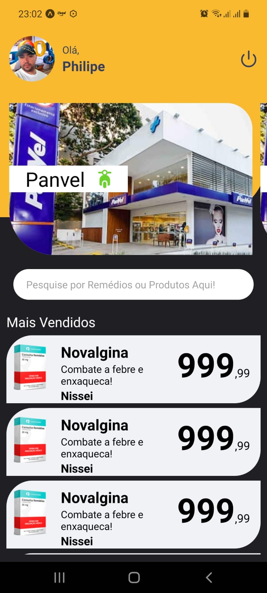

# BePharmaBee

Mesmo que em meio a crescente tecnologia encontrar remédios e produtos vínculados a área de saúde não é uma tarefa fácil! 
Esta é uma solução focada em menores preços, farmácias mais próximas e benefícios aos usuários.

* Aplicativo (React - Native)
* Web (React Js)
* Servidor (Node Js)
* Hospedagem (AWS)

​	Até o momento foram criadas as primeiras linhas de código referente ao construção do App para Android e IOS.

  
  

​	 
