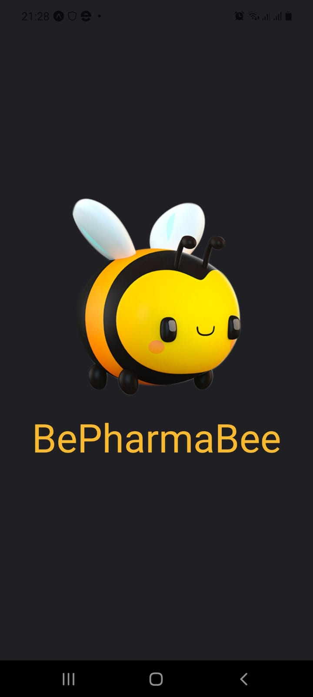
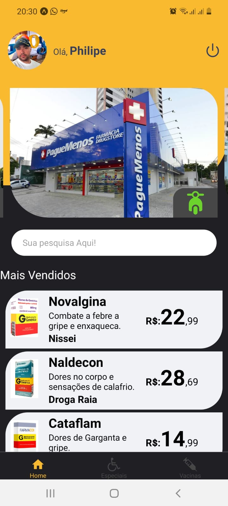

# BePharmaBee 

 
  
  
  
  
  

 

Mesmo que em meio a crescente tecnologia encontrar remédios e produtos vínculados a área de saúde não é uma tarefa fácil! 
Esta é uma solução focada em menores preços, farmácias mais próximas e benefícios aos usuários.

* Aplicativo (React - Native)
* Web (React Js)
* Servidor (Node Js)
* Hospedagem (AWS)

Até o momento foram criadas as primeiras linhas de código referente ao construção do App para Android e IOS.
 
<table align="center" border="1">
    <thead>
    	<tr>
        <th>Splash</th>
        <th>Login</th>
        <th>Home</th>
      </tr>
    </thead>
    <tbody>
    	<tr>
        <td align="center"></td>
        <td align="center"></td>
        <td align="center"></td>
      </tr>
    </tbody>
</table>

​	 
